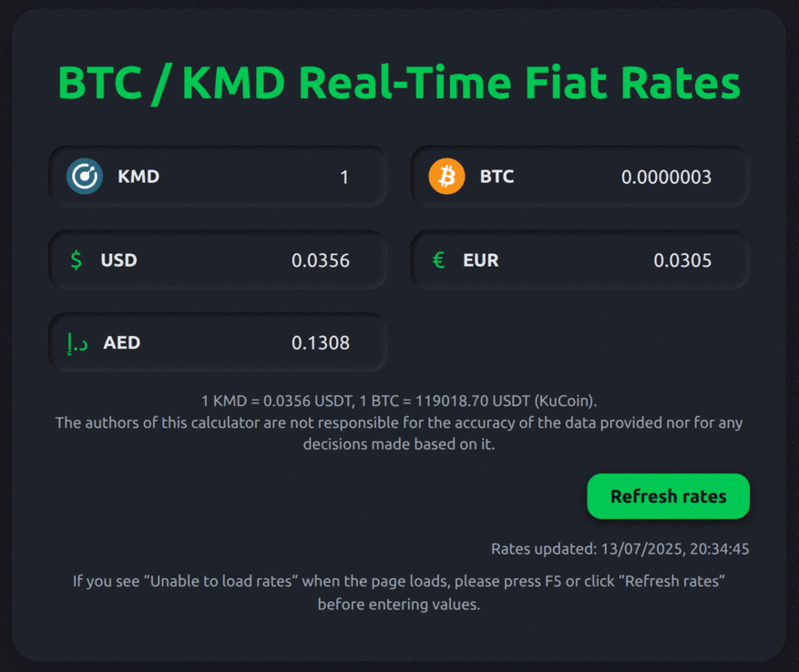

# BTC / KMD ⇆ Fiat Converter

A **single-page, client-side calculator** that lets you convert Komodo (KMD) and Bitcoin (BTC) values to—and back from—several fiat currencies (USD, EUR, RUB, AED) in real time.

| Screenshot | Tech stack |
|------------|------------|
|  | 💯 Pure **HTML + CSS + vanilla JavaScript** (no frameworks) |

---

## What it does -- _in a nutshell_

* Pulls the latest **BTC/USDT** and **KMD/USDT** prices from the public **KuCoin REST API**.  
* Converts those quotes to USD first, then to the selected fiat currencies using the free **open.er-api.com** feed.  
* Runs entirely in the browser—no build step, database or server required.  
* Looks good out-of-the-box thanks to a lightweight dark-neumorphic theme.

### CORS compatibility

KuCoin’s API is not CORS-enabled for browsers.  
To keep the code zero-backend, requests are routed through the public [**AllOrigins**](https://github.com/gnuns/allorigins) proxy:

```js
const cors = url => `https://api.allorigins.win/raw?url=${encodeURIComponent(url)}`;
fetch(cors('https://api.kucoin.com/api/v1/prices?base=USD')) …
